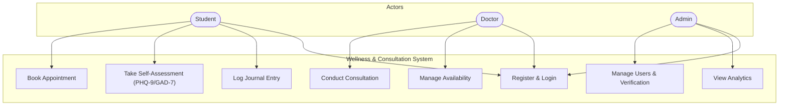
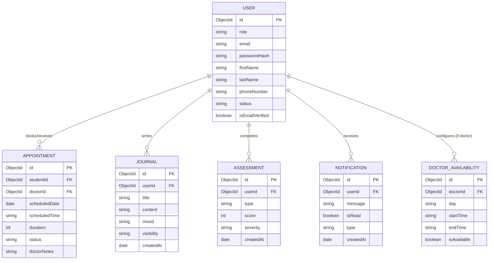
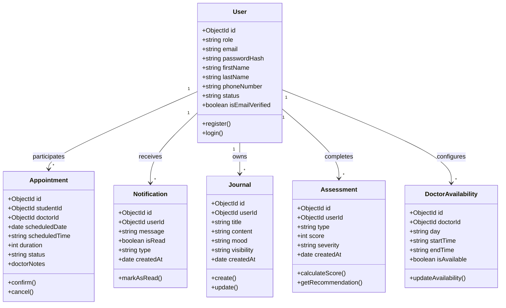
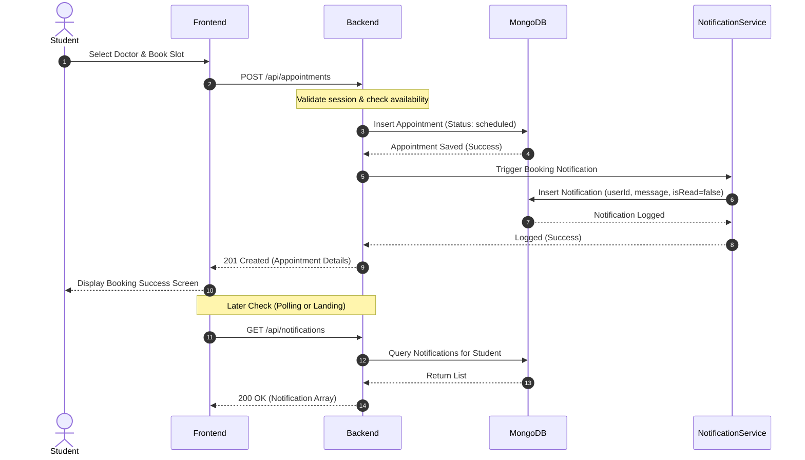

# Student Mental Wellness & Doctor Consultation Platform
## Comprehensive Revised Specification (PRD, TRD, and SRS)

---

## 1. Executive Summary & Context

This document serves as the unified reference for the **Student Mental Wellness & Doctor Consultation Platform**. It addresses the critical gaps identified in the original PRD, TRD, and SRS reviews, ensuring a consistent design across requirements, database schema, APIs, and UML diagrams.

### Clinical Assessment Standards
- **PHQ-9 (Patient Health Questionnaire-9)**: A clinically accepted 9-question depression screening instrument. The platform aggregates responses (each scored 0-3) to yield a total score of 0-27, categorizing depression severity (None, Mild, Moderate, Moderately Severe, Severe) and recommending next steps.
- **GAD-7 (Generalized Anxiety Disorder-7)**: A standardized 7-question anxiety screening instrument. Responses (scored 0-3) yield a total score of 0-21, categorizing anxiety severity (None, Mild, Moderate, Severe) to prompt clinical attention.

---

## 2. Updated Entity Schemas & Database Design

### 2.1 MongoDB Collections Schema (MERN Stack Integration)

#### A. User Collection
```javascript
{
  _id: ObjectId,
  role: 'student' | 'doctor' | 'admin',
  email: String (unique, lowercase),
  passwordHash: String,
  firstName: String,
  lastName: String,
  phoneNumber: String (E.164 format),
  status: 'active' | 'inactive' | 'suspended',
  isEmailVerified: Boolean,
  createdAt: Date,
  updatedAt: Date
}
```

#### B. Appointment Collection
```javascript
{
  _id: ObjectId,
  studentId: ObjectId, // Link to Student (User)
  doctorId: ObjectId,   // Link to Doctor (User)
  scheduledDate: Date,
  scheduledTime: String,           // HH:MM format
  duration: Number,                // in minutes (default: 30)
  status: {
    type: String,
    enum: ["scheduled", "completed", "cancelled"],
    default: "scheduled"
  },
  doctorNotes: String,
  createdAt: Date,
  updatedAt: Date
}
```

#### C. Notification Collection
```javascript
{
  _id: ObjectId,
  userId: ObjectId,    // Target User (Student or Doctor)
  message: String,
  isRead: Boolean,
  type: 'appointment_reminder' | 'assessment_prompt' | 'general',
  createdAt: Date                  // Timestamp
}
```

#### D. Journal Collection
```javascript
{
  _id: ObjectId,
  userId: ObjectId,
  title: String,
  content: String,
  mood: 'very_sad' | 'sad' | 'neutral' | 'happy' | 'very_happy',
  tags: String[],
  visibility: 'private' | 'doctor_visible',
  createdAt: Date,
  updatedAt: Date
}
```

#### E. Assessment Collection
```javascript
{
  _id: ObjectId,
  userId: ObjectId,
  type: {
    type: String,
    enum: ["PHQ9", "GAD7"]
  },
  answers: Number[],               // Array of scores per question (0-3)
  score: Number,                   // Calculated sum
  severity: String,                // None | Mild | Moderate | Severe
  interpretation: String,
  createdAt: Date                  // Timestamp for trend generation
}
```

#### F. DoctorAvailability Collection
```javascript
{
  _id: ObjectId,
  doctorId: ObjectId,              // Link to Doctor (User with role=doctor)
  day: String,                     // e.g. "Monday"
  startTime: String,               // e.g. "09:00"
  endTime: String,                 // e.g. "17:00"
  isAvailable: Boolean
}
```

---

## 3. UML Diagrams (Mermaid Format)

### 3.1 Use Case Diagram
Represented via `flowchart TD` to ensure universal rendering compatibility.



### 3.2 Entity-Relationship (ER) Diagram
Reflects relationships mapped to the 6 system collections.



### 3.3 Class Diagram



### 3.4 Sequence Diagram (Appointment Booking)
Incorporates database-driven notifications and api-based fetching.



---

## 4. Consistent API Endpoints & System Mechanics

### 4.1 System API Specs

#### Auth
- `POST /api/auth/register`
- `POST /api/auth/login`

#### Journals
- `GET /api/journals`
- `POST /api/journals`
- `PUT /api/journals/:id`
- `DELETE /api/journals/:id`

#### Assessments
- `POST /api/assessments`
- `GET /api/assessments/history`

#### Availability
- `POST /api/availability`
- `GET /api/availability/:doctorId`

#### Appointments
- `POST /api/appointments`
- `GET /api/appointments`
- `PATCH /api/appointments/:id/cancel`

#### Notifications
- `GET /api/notifications`
- `PATCH /api/notifications/:id/read`

#### Dashboard
- `GET /api/dashboard/student` -> returns:
  ```json
  {
    "journalCount": 12,
    "latestPHQ9": 8,
    "latestGAD7": 6,
    "upcomingAppointments": 2
  }
  ```
- `GET /api/dashboard/doctor` -> returns:
  ```json
  {
    "todayAppointments": 5,
    "totalStudents": 24
  }
  ```
- `GET /api/dashboard/admin` -> returns:
  ```json
  {
    "totalUsers": 250,
    "totalDoctors": 12,
    "totalAppointments": 380
  }
  ```

---

## 5. Standard Viva (Oral Examination) Questions & Answers

* **Q1: Why was PHQ-9 chosen for depression screening?**
  * **A:** PHQ-9 is a clinically validated, 9-question tool that measures depression severity based on diagnostic criteria. It is standardized, easy to implement in software, and yields actionable clinical insights.
* **Q2: Why was GAD-7 chosen for anxiety screening?**
  * **A:** GAD-7 is a standardized 7-question clinical questionnaire designed to screen for generalized anxiety disorder and determine severity (mild, moderate, or severe).
* **Q3: Why MongoDB instead of SQL databases like PostgreSQL?**
  * **A:** MongoDB supports document flexibility, allowing journals and assessments (which often have variant forms or schema changes) to be stored as simple, nested JSON files. It aligns seamlessly with Node.js/MERN stack development workflows.
* **Q4: How does stateless authentication work with JWT?**
  * **A:** The server verifies credentials, generates a signed JSON Web Token (JWT) with user roles, and sends it to the client. The client attaches this token in the `Authorization` header on API requests. The server verifies the token signature without database queries, ensuring high performance.
* **Q5: Why build the frontend using React?**
  * **A:** React utilizes a virtual DOM to ensure efficient rendering of components, promotes reusability, and provides a smooth, state-driven user experience for interactive dashboards.
